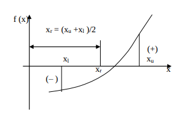

# What is the Mid Point Method ?

The midpoint method is a method created in numerical analysis 
to find the values ​​(roots) of an equation that make it equal 
to the value 0.  

Let's talk about a given range of values ​​[a,b] and a function y=f(x).  

If f(a)*f(b)<0, it is possible to say that the graph of the f function 
changes sign at least once in this interval.  

  

In this case, we can approximate and test the x value at which the 
sign changes by using the formula x_r=(a+b)/2.  

Our new value created gives us 3 possibilities. Either this x_r value is the root. 
Either stays on the ascending side of the root. Or it is on the decreasing side. 
By constantly examining these situations, we constantly approach the possible 
root with the desired margin of error.  

In order to use the written code more easily and in a wide range, sympy 
computer-based algebra library was used. Here are some codes that seem unusual.  

[YouTube] ( https://www.youtube.com/watch?v=6PwS9YlZa3k “YouTube”)  
[Wikipedia] ( https://en.wikipedia.org/wiki/Midpoint_method “WikiPedia”)  
[Sympy] (https://docs.sympy.org/latest/index.html "Sympy Library Offical Documentation")  

Task List  
-[x] Check the bugs  
-[x] Implementing to numerical integrals  
-[x] Checking the continuity of the function  

