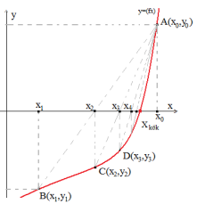

Differentiation in the Newton-Raphson method we learned earlier
There may be times when we may have difficulties in the process. 
Secant method comes to our rescue at this point.  

As we mentioned above, how much is the newton-raphson method?
encounter an equation that is difficult to derive, no matter how fast
It can be as slow as it is fast. from the polynomial rather, its 
derivatives are very difficult or time-consuming to calculate.
There are functions. In such cases, the derivative of backward 
finite differences with the approach.  

Between points A-B in the figure, the initial values ​​of x0 and x1
closer to the real root without derivatization using root can be found.  

The point where the beam intersects the x-axis is the point 
close to the root.  

By finding a new chord points in each new iteration
The root is approached with new points where the beams 
intersect the x-axis.  

This process has a certain error limitation as in other methods.
until repeated.  

[YouTube] ( https://www.youtube.com/watch?v=_MfjXOLUnyw “YouTube”)  
[Wikipedia] ( https://en.wikipedia.org/wiki/Secant_method “WikiPedia”)  
[Sympy] (https://docs.sympy.org/latest/index.html "Sympy Library Offical Documentation")  

Task List  
-[x] Check the bugs  
-[x] Checking the continuity of the function  
